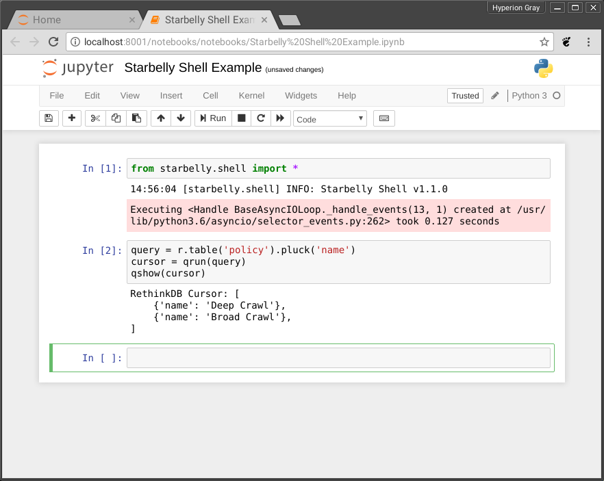

***************
Developer Guide
***************

.. contents::
    :depth: 2

Technologies Used
=================

If you are thinking about helping out with Starbelly development, it will be
useful to familiarize yourself with the different components and technologies
being used:

- `Starbelly Docker <https://github.com/hyperiongray/starbelly-docker>`__

  * `Docker <https://docs.docker.com/>`__
  * `Docker Compose <https://docs.docker.com/compose/>`__

- `Starbelly Protobuf <https://github.com/hyperiongray/starbelly-protobuf>`__

  * `Protobuf <https://developers.google.com/protocol-buffers/>`__

- `Starbelly Server <https://github.com/hyperiongray/starbelly>`__

  * `Asyncio <https://docs.python.org/3/library/asyncio.html>`__
  * `Python 3 <https://docs.python.org/3/>`__
  * `Restructed Text <http://docutils.sourceforge.net/docs/ref/rst/restructuredtext.html>`__
  * `RethinkDB <https://www.rethinkdb.com/>`__
  * `WebSockets <https://developer.mozilla.org/en-US/docs/Web/API/WebSockets_API>`__

- `Starbelly Web Client <https://github.com/hyperiongray/starbelly-web-client>`__

  * `Angular <https://webdev.dartlang.org/angular>`__
  * `Dart <https://www.dartlang.org/>`__

Getting Started
===============

If you wish to contribute to Starbelly development, you should first make sure
that you have gone through the Developer Installation in the
:doc:`installation`. Once you have done that, go through the :doc:`api` and get
familiar with how the client and server interact.

Common Tasks
============

As you start working on Starbelly code, you'll encounter some common tasks that
you wish to perform. In the examples below, if a command prompt is prefixed with
a container name, then that indicates that the command must be run inside a
specific Docker container. For example, if you see this:

.. code::

    starbelly-dev-app:/starbelly# ls /usr/local/etc
    jupyter

Then that command should be run inside of the ``starbelly-dev-app`` container.
To obtain a shell inside that container, run:

.. code::

    $ docker exec -it starbelly-dev-app /bin/bash
    starbelly-dev-app#

You can use the same technique to get a shell inside the ``starbelly-dev-db`` or
``starbelly-dev-web`` containers.

Build Documentation
-------------------

This documentation that you are reading is written in RestructuredText format
and stored in the main ``starbelly`` repo under ``/docs``.

.. code::

    starbelly-dev-app:/starbelly/docs# make html
    Running Sphinx v1.7.1
    loading pickled environment... done
    building [mo]: targets for 0 po files that are out of date
    building [html]: targets for 0 source files that are out of date
    updating environment: 0 added, 0 changed, 0 removed
    looking for now-outdated files... none found
    no targets are out of date.
    build succeeded.

To view the documentation, use your web browser to navigate to the host's
``starbelly/docs/_build/html/index.html``.

Clear Database
--------------

See the :doc:`administration`.

Database Query
------------------

There are two ways to run RethinkDB queries. The easiest way is to access the
RethinkDB GUI on port 8002 using your browser. You can browse lots of
information about the database or use the "Data Explorer" to run queries. Note
that this interface only allows
`JavaScript queries <https://www.rethinkdb.com/api/javascript/>`__, so if you
are trying to troubleshoot a
`Python query <https://www.rethinkdb.com/api/python/>`__ you will need to
translate it into JavaScript.

.. image:: rethinkdb_gui.png
   :alt: the RethinkDB GUI

If you want to run a Python query, you can use the Starbelly Shell instead,
but it is a bit less pretty than the GUI:

.. code::

    >>> query = r.table('policy').pluck('name')
    >>> cursor = qrun(query)
    >>> qshow(cursor)
    RethinkDB Cursor: [
        {'name': 'Deep Crawl'},
        {'name': 'Broad Crawl'},
    ]

The "Starbelly Shell" section contains more details about the shell.

Notebook
--------

A `Jupyter server <http://jupyter.org/>`__ is included in the developer Docker
images to make it easy to build a notebook for experiments and prototypes. A
notebook can also be a slightly easier way to use the Starbelly Shell (see
below).

Begin by running the Jupyter server:

.. code::

    starbelly-dev-app:/starbelly# jupyter notebook --allow-root --ip 0.0.0.0 --NotebookApp.token=''
    [W 20:44:35.840 NotebookApp] All authentication is disabled.  Anyone who can connect to this server will be able to run code.
    [I 20:44:35.850 NotebookApp] Serving notebooks from local directory: /starbelly
    [I 20:44:35.850 NotebookApp] 0 active kernels
    [I 20:44:35.850 NotebookApp] The Jupyter Notebook is running at:
    [I 20:44:35.850 NotebookApp] http://0.0.0.0:8888/
    [I 20:44:35.850 NotebookApp] Use Control-C to stop this server and shut down all kernels (twice to skip confirmation).

Now access the Jupyter server by going to ``localhost:8001`` in your browser.

.. image:: jupyter_notebook.png
   :alt: the Jupyter notebook GUI

You can create and manage your notebooks here. In each notebook, you'll probably
want to begin by importing the shell functions:

.. code::

    from starbelly.shell import *

Then you can run commands inside the notebook just like you can from the
Starbelly Shell:

When you are done, type <Ctrl>+C on the command line to shut down the Jupyter
server. An `example notebook <https://github.com/HyperionGray/starbelly/blob/mas
ter/notebooks/Frontier%20Reloading.ipynb>`__ is included in the repository.

Starbelly Shell
---------------

The Starbelly shell is an interactive Python interpreter that offers quick
access to Starbelly's internal API, and it is a good place to debug little bits
of code. The Shell cannot directly access the server's internal state at
runtime, but it does use the same exact code paths as the server to do things
like parsing configuration files and connecting to a database.

To start the shell:

.. code::

    starbelly-dev-app:/starbelly# python3 -im starbelly.shell
    20:03:42 [starbelly.shell] INFO: Starbelly Shell v1.1.0
    >>>

This Python prompt has a lot of additions to the global namespace and helpers
for debugging code. For example, you can view the configuration:

.. code::

    >>> config['database']['user']
    'starbelly-app'

Note that the name ``config`` (and many others) have already been imported into
the shell's namespace.

You can run arbitrary coroutines with ``crun()``:

.. code::

    >>> async def foo():
    ...   await asyncio.sleep(0.1)
    ...   print('done!')
    ...
    >>> crun(foo())
    done!

You can run a query against RethinkDB:

    >>> query = r.table('policy').pluck('name')
    >>> cursor = qrun(query)
    >>> qshow(cursor)
    RethinkDB Cursor: [
        {'name': 'Deep Crawl'},
        {'name': 'Broad Crawl'},
    ]

.. warning::

    Showing the results of a query will exhaust the cursor object! If you
    try to do anything else with the cursor, you will find that it has no more
    data. You need to ``qrun()`` the query again to get a fresh cursor.

You can also run a callback on each row of a cursor to transform the data.

    >>> def lower(row):
    ...   return {k:v.lower() for k,v in row.items()}
    ...
    >>> query = r.table('policy').pluck('name')
    >>> cursor = qrun(query)
    >>> qiter(cursor, lower)
    [{'name': 'deep crawl'}, {'name': 'broad crawl'}]

You can also use the Starbelly Shell functions inside of a Notebook. See the
"Notebook" section above.
