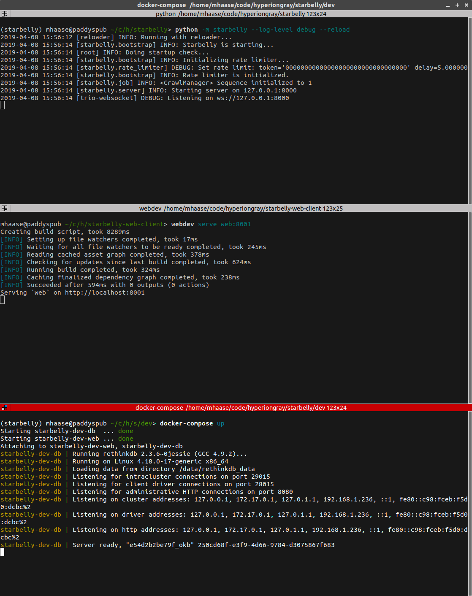

Developer Guide
===============

Technologies Used
-----------------

If you are thinking about helping out with Starbelly development, it will be
useful to familiarize yourself with the different components and technologies
being used:

- `Starbelly Docker <https://github.com/hyperiongray/starbelly-docker>`__

  * `Docker <https://docs.docker.com/>`__
  * `Docker Compose <https://docs.docker.com/compose/>`__

- `Starbelly Protobuf <https://github.com/hyperiongray/starbelly-protobuf>`__

  * `Protobuf <https://developers.google.com/protocol-buffers/>`__

- `Starbelly Server <https://github.com/hyperiongray/starbelly>`__

  * `Pipenv <https://pipenv.readthedocs.io/en/latest/>`__
  * `Python 3 <https://docs.python.org/3/>`__
  * `Restructed Text <http://docutils.sourceforge.net/docs/ref/rst/restructuredtext.html>`__
  * `RethinkDB <https://www.rethinkdb.com/>`__
  * `Trio <https://trio.readthedocs.io>`__
  * `WebSockets <https://developer.mozilla.org/en-US/docs/Web/API/WebSockets_API>`__

- `Starbelly Python Client <https://github.com/hyperiongray/starbelly-python-client>`__

  * `Python 3 <https://docs.python.org/3/>`__
  * `Trio <https://trio.readthedocs.io>`__

- `Starbelly Web Client <https://github.com/hyperiongray/starbelly-web-client>`__

  * `Angular <https://webdev.dartlang.org/angular>`__
  * `Dart <https://www.dartlang.org/>`__

Setting Up Dev Environment
--------------------------

In a typical dev environment, you will need to run the following components:

- Starbelly Server (on your localhost)
- Starbelly Web Client (on your localhost)
- RethinkDB Database Server (in Docker)
- Nginx Web Server (in Docker)

To set up this environment, you will need the following items installed:

* `Docker <https://www.docker.com/>`__
* `Pipenv <https://pipenv.readthedocs.io/en/latest/>`__
* `Chromium <https://www.chromium.org/>`__ (optional, but it is the only
  officially supported browser for Dart development)

Clone the following repositories:

1. `Starbelly server <https://github.com/hyperiongray/starbelly>`__: ``git clone
   https://github.com/hyperiongray/starbelly``
2. `Starbelly client <https://github.com/hyperiongray/starbelly-web-client>`__:
   ``https://github.com/hyperiongray/starbelly-web-client``

Now run the Docker containers:

1. Go into the ``starbelly/`` directory and install the server's dependencies:
   ``pipenv install --dev``.
2. Open a pipenv shell: ``pipenv shell``.
3. Go into the ``starbelly/dev/`` directory and run ``python gencert.py
   localhost`` to create a development web certificate.
4. Go to the ``starbelly/dev/`` directory and run ``docker-compose up`` to start
   the Docker containers.

In a second terminal, run the Starbelly server:

1. Go to the ``starbelly/`` directory and start a new shell: ``pipenv shell``.
2. Run the container initialization script: ``python tools/container_init.py``.
3. Start the application server: ``python -m starbelly --log-level debug --reload``.

In a third terminal run the web client's build server:

1. Go into to the ``starbelly-web-client/`` directory and run `pub get`.
2. Run: ``webdev serve web:8001``. (This step takes 15-20 seconds.)

If all has gone well, your terminal should look something like this:

Now you can navigate to ``https://localhost`` to view the application in your
browser.

TODO ADD SCREENSHOT HERE

You should also set up client-side logging by going into the web inspector,
clicking "Application" → "Local Storage" → "https://localhost" and adding a new
key named ``starbelly-debug`` with the value ``true``. Refresh the page and you
should see some log messages in the browser console.

You now have the following services running:

================  ===========================
Service           Ports
================  ===========================
Nginx             80 (redirect), 443
RethinkDB         8080 (GUI), 28015 (API)
Starbelly Server  8000
Dart Server       8001
================  ===========================

The only ports you will typically need to use are the Nginx on 443 and RethinkDB
on 8080.

Common Tasks
------------

As you start working on Starbelly code, you'll encounter some common tasks that
you wish to perform. In the examples below, if a command prompt is prefixed with
a container name, then that indicates that the command must be run inside a
specific Docker container. For example, if you see this:

.. code::

    starbelly-dev-app:/starbelly# ls /usr/local/etc
    jupyter

Then that command should be run inside of the ``starbelly-dev-app`` container.
To obtain a shell inside that container, run:

.. code::

    $ docker exec -it starbelly-dev-app /bin/bash
    starbelly-dev-app#

You can use the same technique to get a shell inside the ``starbelly-dev-db`` or
``starbelly-dev-web`` containers.

Build Documentation
-------------------

This documentation that you are reading is written in RestructuredText format
and stored in the main ``starbelly`` repo under ``/docs``.

.. code::

    starbelly-dev-app:/starbelly/docs# make docs
    Running Sphinx v1.7.1
    loading pickled environment... done
    building [mo]: targets for 0 po files that are out of date
    building [html]: targets for 0 source files that are out of date
    updating environment: 0 added, 0 changed, 0 removed
    looking for now-outdated files... none found
    no targets are out of date.
    build succeeded.

To view the documentation, use your web browser to navigate to
``starbelly/docs/_build/html/index.html``.

Clear Database
--------------

See the :doc:`administration`.

Database Query
--------------

There are two ways to run RethinkDB queries. The easiest way is to access the
RethinkDB GUI on port 8002 using your browser. You can browse lots of
information about the database or use the "Data Explorer" to run queries. Note
that this interface only allows
`JavaScript queries <https://www.rethinkdb.com/api/javascript/>`__, so if you
are trying to troubleshoot a
`Python query <https://www.rethinkdb.com/api/python/>`__ you will need to
translate it into JavaScript.

If you want to run a query using the Python API, you can use the Starbelly shell
instead.

Starbelly Shell
---------------

The Starbelly shell offers an interpreter with quick access to Starbelly's
internal API, and it is a good place to debug little bits of code. The shell
cannot directly access the server's internal state at runtime, but it is useful
for things like inspecting config files or running ad hoc database queries.

.. code::

    $ python tools/shell.py
    IPython Shell: Starbelly v2.0.0
    In [1]:

The shell initializes some global variables and then presents you with an
`IPython prompt <https://ipython.org/>`__. You can access the ``config`` and
``logger`` objects here.

.. code::

    In [1]: config['database']['user']
    Out[1]: 'starbelly-app'

    In [2]: logger.info('Hello, world!')
    12:52:17 [tools.shell] INFO: Hello, world!

The shell imports the ``trio`` package for you and is setup to handle async
functions. The following snippet defines an async function and shows two
equivalent ways of running it.

.. code::

    In [3]: async def foo(): await trio.sleep(1)

    In [4]: await foo()

    In [5]: trio.run(foo)

You can also run a query and display the results.

.. code::

    In [6]: policy_query = r.table('policy').pluck('name')

    In [7]: policy_results = run_query(policy_query)

    In [8]: print_results(policy_results)
    RethinkDB Cursor: [
        {'name': 'Deep Crawl'},
        {'name': 'Broad Crawl'},
    ]

.. warning::

    Printing the results of a query will exhaust the cursor object! If you
    try to do anything else with the cursor, you will find that it has no more
    data. You need to run the query again to get a new cursor.

Jupyter Notebook
----------------

The Starbelly shell is also compatible with Jupyter Notebook, which may be a
more user-friendly way to access the shell. If you haven't used it before,
Jupyter Notebook is a great way to experiment and prototype code. (The
``notebooks`` directory of the repository contains some examples that you can
view directly on GitHub.)

If you haven't installed Jupyter before, you'll need to install it. (It is not
installed with the Starbelly developer installation.) It does not need to be
installed within the virtual environment. In fact, if you want to use it with
other projects, it works quite well installed into your global Python packages.
It can be installed with Python 2 or 3, but we recommend Python 3.

.. code::

    $ sudo pip3 -H install jupyter

You will want to make sure that you have a Python 3.7 IPython kernel installed.
Run the following command inside your virtual environment

.. code::

    (starbelly) $ python -m ipykernel install --user --name starbelly \
                         --display-name "Python 3.7 (starbelly)"

After doing this one-time step, you can start a notebook server by running the
following command from the project root.

.. code::

    (starbelly) $ jupyter notebook
    [I 12:58:37.849 NotebookApp] Serving notebooks from local directory: /home/mhaase/code/starbelly
    [I 12:58:37.849 NotebookApp] The Jupyter Notebook is running at:
    [I 12:58:37.849 NotebookApp] http://localhost:8888/?token=d607f8171694c628db8e7877570e4968f59267120fb49c3e
    [I 12:58:37.849 NotebookApp] Use Control-C to stop this server and shut down all kernels (twice to skip confirmation).
    [C 12:58:37.874 NotebookApp]

Now access the Jupyter server by going to `localhost:8888
<http://localhost:8888>`__ in your browser. If you installed the IPython kernel
correctly, you should see a "Python 3.7 (starbelly)" option when you go to
create a new notebook. You should choose this option when you wish to interact
with the Starbelly shell.

In the first cell of your new notebook, you should run the following commands:

.. code::

    %autoawait trio
    from pathlib import Path
    from sys import path
    path.append(str(Path().resolve().parent))
    from tools.shell import *

These commands assume that you create your notebook in the ``notebooks``
directory, so you may need to adjust if you create them elsewhere. After that,
you have access to everything in the IPython shell described above.

