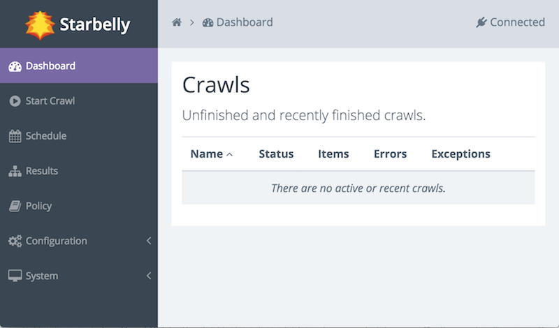

Installation Guide
==================

Prerequisites
-------------

Starbelly is offered as a collection of Docker images and Docker-compose
configurations. If you're not familiar with Docker, it is a system for deploying
multiple software components into individual containers and orchestrating the
entire system.

First, install `Docker <https://docs.docker.com/engine/installation/>`__ using
the instructions for your platform.

Next, install `Docker Compose <https://docs.docker.com/compose/install/>`__
using the instructions for your platform.

Docker Compose
--------------

Docker Compose is used to set up and run multiple Docker containers together.
You should have installed Docker Compose in the previous step. Now you need a
Docker Compose configuration file (usually called ``docker-compose.yml``) that
specifies what containers need to be created and how they should be configured.
A sample docker-compose.yml configuration file is available for Starbelly, but
you may need to tailor this file to your unique environment.

Download this `zip file
<https://github.com/HyperionGray/starbelly-docker/archive/master.zip>`__
and extract it. (If you have Git installed, you can run ``git clone
git@github.com:HyperionGray/starbelly-docker.git`` instead.) From the
``starbelly-docker/starbelly`` directory, run the following command:

.. code::

    $ docker-compose up -d

This will download the required Docker images, create the corresponding
containers, and then start the entire application on ports 80 and 443. Once
the application has started, open up a browser and try navigating to the host
where you are running Starbelly. The default username and password is "admin".

You should see the Dashboard:

If you experience any problems, try using the command ``docker-compose logs``
to view logging output from the Docker containers.

Security
--------

If your Starbelly instance is exposed to the internet, then you should
immediately do two things to secure it:

1. Change the admin password.
2. Create TLS certificates

The **admin password** is stored in a file called ``htpasswd`` and it can be
created or edited using the ``htpasswd`` command from the Apache2 utilities
package (called ``apache2-utils`` on Ubuntu distributions). Install that package
and then run this command:

.. code::

    $ htpasswd -c passwd admin
    New password:
    Re-type new password:
    Adding password for user admin

Type in the new password when prompted. You can change passwords or add
additional passwords to an existing file by running ``htpasswd passwd USER``,
where ``USER`` is the username to change. When you are done, copy the ``passwd``
file into the Docker container and remove the original.

.. code::

    $ docker cp passwd starbelly-web:/etc/nginx/tls/
    $ docker exec starbelly-web nginx -s reload
    2017/11/02 14:29:37 [notice] 1437#1437: signal process started
    $ rm passwd

The default **TLS certificate** is automatically generated and self-signed when
the container is created. If you have a valid domain name for your Starbelly
server, then you should obtain a real certificate for it.

If you have obtained your own certificates, you can install them as follows,
where ``certificate.pem`` is the full certificate chain in PEM format and
``privatekey.pem`` is the private key in PEM format.

.. code::

    $ docker cp certificate.pem starbelly-web:/etc/nginx/tls/server.crt
    $ docker cp privatekey.pem starbelly-web:/etc/nginx/tls/server.key
    $ docker exec starbelly-web nginx -s reload
    2017/11/02 14:29:37 [notice] 1437#1437: signal process started

If you do not already have TLS certificates, you may obtain free certificates
from `Let's Encrypt <https://letsencrypt.org/>`__. First, install the certbot
application using the `instructions for your platform
<https://certbot.eff.org/>`__. Now run certbot to create initial certificates,
replacing ``YOUR_DOMAIN`` with the fully qualified domain name of the server and
replacing ``/path/to/starbelly-docker/starbelly`` with the path where you placed
the Starbelly docker configuration files from an earlier step.

.. code::

    $ cd /path/to/starbelly-docker/starbelly
    $ certbot certonly \
        --webroot -w certbot-webroot \
        -d YOUR_DOMAIN \
        --deploy-hook ./deploy-certbot.py
    Plugins selected: Authenticator webroot, Installer None
    Enter email address (used for urgent renewal and security notices) (Enter 'c' to
    cancel): YOUR EMAIL HERE

    -------------------------------------------------------------------------------
    Please read the Terms of Service at
    https://letsencrypt.org/documents/LE-SA-v1.1.1-August-1-2016.pdf. You must agree
    in order to register with the ACME server at
    https://acme-staging.api.letsencrypt.org/directory
    -------------------------------------------------------------------------------
    (A)gree/(C)ancel: a

    ...snip...

This command will attempt to get TLS certificates from the Let's Encrypt server.
If you've never run certbot on this server before, it will prompt you to enter
a contact e-mail address and agree to the terms of service.

If certificate generation succeeds, it will install those certificates into the
Docker container. This certificate is valid for 90 days and will need to be
renewed before it expires. Create a daily cron job containing the following
command to ensure that the certificate will be renewed appropriately.

.. code::

    certbot renew --deploy-hook /path/to/starbelly-docker/starbelly/deploy-certbot.py

Next Steps
----------

Now that you have Starbelly up and running, take a look at :doc:`first_crawl`.
